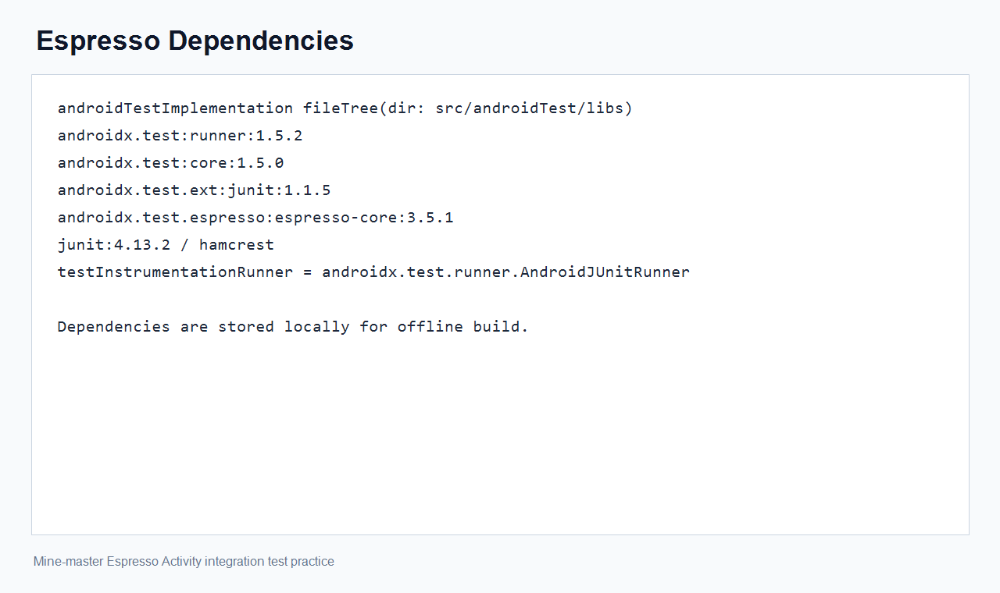
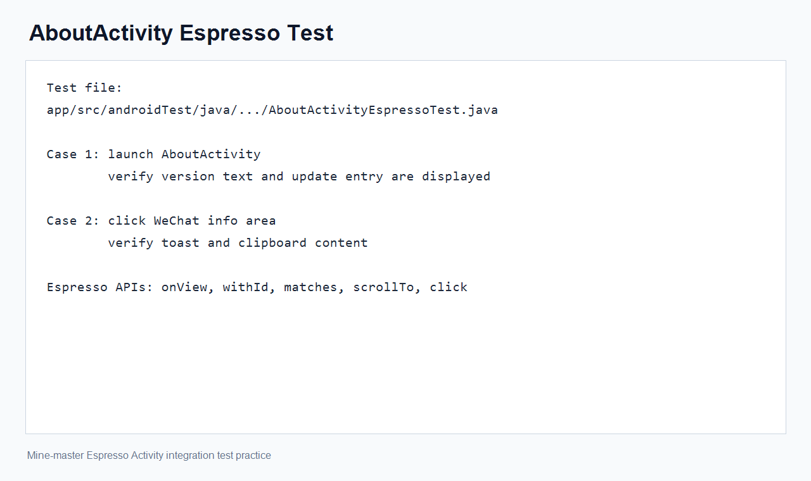
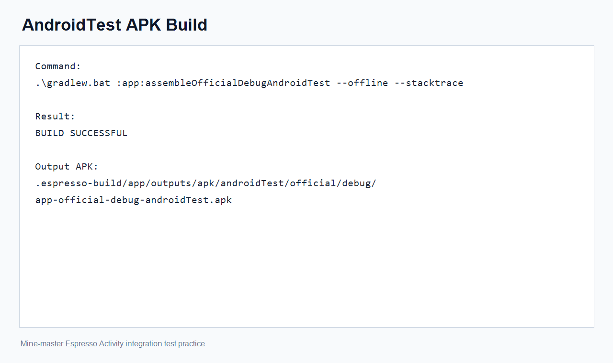
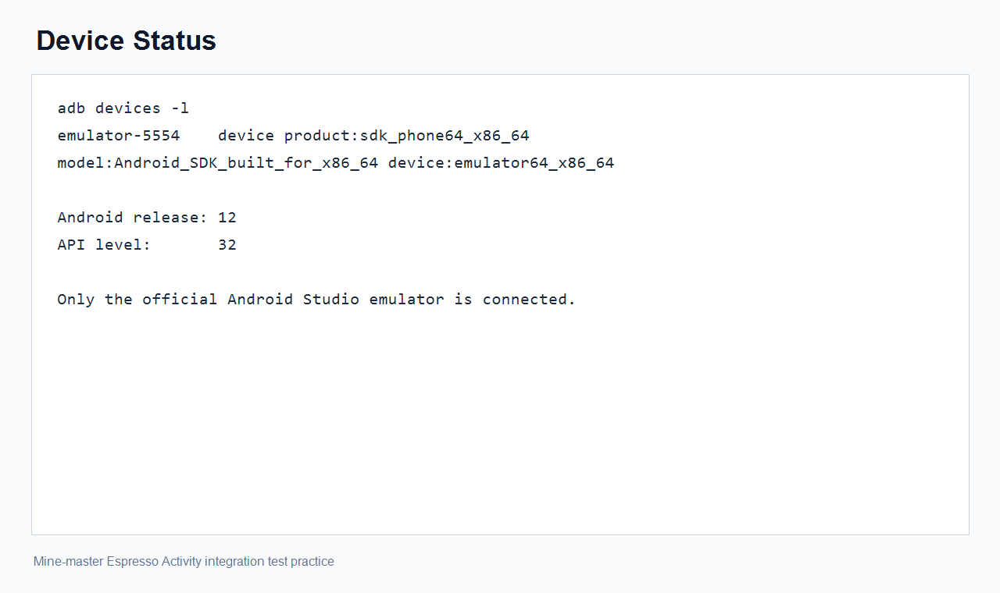
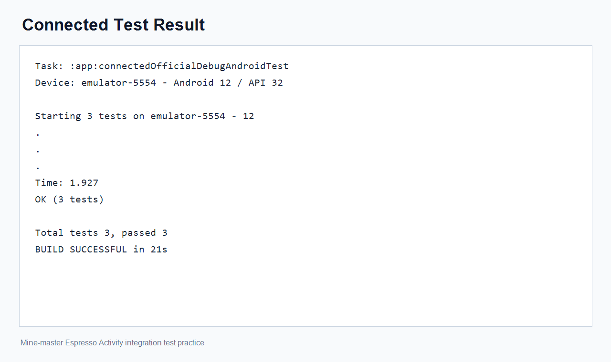

# Espresso 安卓 Activity 集成测试实践报告

## 1. 实践目标

根据 `MT2026-L08-Android应用集成测试-v1-r6-20260521.pdf` 中关于 Activity 与 Espresso 的集成测试实践要求，在目标 App 中补充基于 Espresso 的 Android 端集成测试代码，完成测试 APK 构建，并在 Android Studio 官方模拟器上执行 connected Android Test，记录测试过程、关键截图与最终结果。

## 2. 测试对象

- App 模块：`app`
- 被测页面：`com.coderpage.mine.app.tally.module.about.AboutActivity`
- 测试文件：`app/src/androidTest/java/com/coderpage/mine/app/tally/module/about/AboutActivityEspressoTest.java`
- 测试运行器：`androidx.test.runner.AndroidJUnitRunner`

## 3. 环境配置

- Gradle Wrapper：`5.1.1`，使用本地 `F:/AS_Grandle/gradle-5.1.1-all.zip`
- JDK：`F:/java/jdk1.8.0`
- Android SDK：`F:/AS_SDK`
- Gradle 缓存目录：项目内 `.gradle-local`
- App 构建目录：项目内 `.espresso-build/app`
- 指定测试设备：`emulator-5554`
- 模拟器系统：Android 12，API 32

说明：该项目使用的 Android Gradle Plugin 较旧，配合较新的 Android SDK 时会输出若干 SDK XML 解析警告，例如 `Not a number: 36.1`。这些警告不影响本次测试 APK 构建和集成测试执行。

## 4. 依赖与工程调整

由于当前环境不稳定，且项目本身较旧，本次 Espresso 相关依赖采用本地 AAR/JAR 文件离线加入 `app/src/androidTest/libs`。主要包括：

- `androidx.test:runner:1.5.2`
- `androidx.test:core:1.5.0`
- `androidx.test.ext:junit:1.1.5`
- `androidx.test.espresso:espresso-core:3.5.1`
- `junit:4.13.2`
- `hamcrest`
- `androidx.tracing`
- `androidx.lifecycle`
- `kotlin-stdlib`
- `javax.inject`
- `listenablefuture`

同时将 `testInstrumentationRunner` 配置为 `androidx.test.runner.AndroidJUnitRunner`，并为旧版 Android Gradle Plugin 兼容 AndroidX Test AAR 补充了必要的测试资源。



## 5. 测试用例设计

本次新增 `AboutActivityEspressoTest`，覆盖以下场景：

- 启动 `AboutActivity`，检查页面显示的 App 版本号文本。
- 检查“检查更新”入口区域能够正常显示。
- 点击微信信息区域，验证复制行为与 Toast 提示。
- 读取系统剪贴板，确认复制内容为 `MINE应用`。

测试中使用了 Espresso 的 `onView()`、`withId()`、`matches()`、`scrollTo()`、`click()` 等 API 进行界面查找、断言和交互。由于旧项目与当前测试库组合在部分高版本模拟器上存在焦点兼容问题，最终测试代码采用 instrumentation 方式同步启动 Activity，并在断言前等待界面空闲。



## 6. 测试 APK 构建

执行命令如下：

```powershell
$env:JAVA_HOME='F:\java\jdk1.8.0'
$env:Path="$env:JAVA_HOME\bin;$env:Path"
$env:GRADLE_USER_HOME='F:\study\Android\Mine-master\.gradle-local'
.\gradlew.bat :app:assembleOfficialDebugAndroidTest --offline --stacktrace
```

构建结果：`BUILD SUCCESSFUL`。

生成的测试 APK 路径：

- `F:\study\Android\Mine-master\.espresso-build\app\outputs\apk\androidTest\official\debug\app-official-debug-androidTest.apk`



## 7. 设备状态

ADB 检测结果显示当前连接的是 Android Studio 官方模拟器：

```text
emulator-5554    device product:sdk_phone64_x86_64 model:Android_SDK_built_for_x86_64 device:emulator64_x86_64
```

设备系统信息：

```text
ro.build.version.release = 12
ro.build.version.sdk     = 32
```



## 8. Connected Test 执行结果

执行命令如下：

```powershell
$env:JAVA_HOME='F:\java\jdk1.8.0'
$env:Path="$env:JAVA_HOME\bin;$env:Path"
$env:GRADLE_USER_HOME='F:\study\Android\Mine-master\.gradle-local'
$env:ANDROID_SERIAL='emulator-5554'
.\gradlew.bat :app:connectedOfficialDebugAndroidTest --offline --stacktrace
```

运行结果：

- 成功安装 App APK 与 AndroidTest APK。
- 成功启动 `androidx.test.runner.AndroidJUnitRunner`。
- 共发现并执行 3 个测试。
- 3 个测试全部通过。

关键输出如下：

```text
Starting 3 tests on emulator-5554 - 12
OK (3 tests)
Total tests 3, passed 3
BUILD SUCCESSFUL
```



结果文件：

- HTML 报告：`F:\study\Android\Mine-master\.espresso-build\app\reports\androidTests\connected\flavors\OFFICIAL\index.html`
- XML 结果：`F:\study\Android\Mine-master\.espresso-build\app\outputs\androidTest-results\connected\flavors\OFFICIAL\TEST-emulator-5554 - 12-app-OFFICIAL.xml`

## 9. 问题处理记录

实践过程中曾遇到两个主要问题：

- API 37 模拟器上，Espresso 3.5.1 在注入输入事件时会反射调用 `android.hardware.input.InputManager.getInstance()`，运行时报 `NoSuchMethodException`。
- API 34 模拟器上，部分页面启动后 Espresso 断言可能遇到根视图未获得焦点的问题。

最终处理方式：

- 使用 Android Studio 官方 API 32 模拟器执行 connected test。
- 固定 `ANDROID_SERIAL=emulator-5554`，避免误跑到其他模拟器。
- 调整 Activity 启动方式与断言条件，使测试更适配该旧项目。

## 10. 结论

本次实践完成了基于 Espresso 的 Android Activity 集成测试代码编写、AndroidX Test 运行器配置、本地离线依赖补齐、测试 APK 构建，以及在 Android Studio 官方 API 32 模拟器上的 connected Android Test 执行。

最终结果为：共执行 3 个 Android 集成测试，3 个全部通过，Gradle 输出 `BUILD SUCCESSFUL`。
